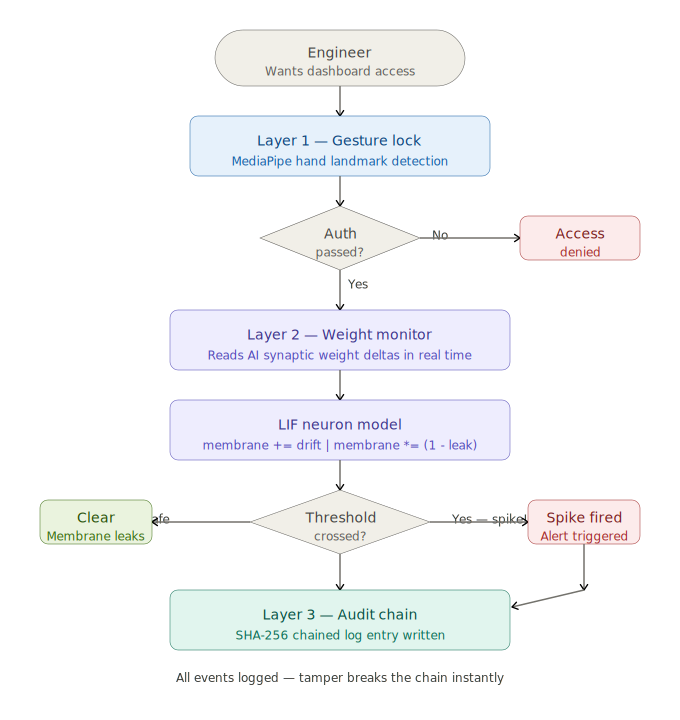

# 🧠 NeuralWatch
### Neuromorphic AI Integrity Monitor for Cybersecurity

[](https://neuralwatch-vv3lpllqcyifqmgcmpqw6a.streamlit.app/)

> *"Every existing cybersecurity tool monitors network traffic — the road. NeuralWatch monitors the brain driving the car."*

---

## The Problem Nobody Is Solving

Modern AI-powered cybersecurity systems store their knowledge in **synaptic weights** — numbers that shift as the AI learns. A sophisticated attacker doesn't attack your network directly anymore.

They **poison the AI itself.**

By feeding it tiny amounts of corrupted data over weeks or months, they gradually shift these weights until the AI starts treating real attacks as normal traffic. By the time the breach surfaces, the guard has already been compromised — and every log looks clean.

> The **SolarWinds attack (2020)** stayed undetected for **9 months** because every individual action looked normal to existing AI. Attackers moved slowly, patiently, below every threshold. Nobody was watching the AI's brain change.

**NeuralWatch is built specifically for this attack.**

---

## Our Solution

NeuralWatch is a three-layer neuromorphic security system that treats the AI's own neural weights as a security surface — not an afterthought.


```

---

## *Layer 1 — Biometric Gesture Lock*

Only an authorized engineer, performing a specific hand gesture via webcam, can access the monitoring dashboard.

- Powered by **MediaPipe hand landmark detection**
- 21-point hand landmark model runs entirely on-device — no data leaves the machine
- Requires sustained gesture hold (2 seconds) to prevent accidental triggers
- Fallback: Demo Bypass mode for judges without webcam access

---

## *Layer 2 — ⭐ Core Innovation: Neuromorphic Drift Detection*

This is what makes NeuralWatch fundamentally different from anything else in cybersecurity.

We simulate a **Leaky Integrate-and-Fire (LIF) neuron** — the foundational model of neuromorphic computing — to monitor the AI's synaptic weights in real time.

```
Normal learning    →  tiny, random weight changes  →  membrane leaks away  →  no spike ✓

Attack in progress →  consistent directional drift  →  membrane builds up
                   →  crosses threshold             →  SPIKE FIRED  →  🚨 ALERT
```

**The key neuromorphic insight:** We don't just check *if* weights changed. We check *how they change over time.* A single small change means nothing. The same small change, repeated in the same direction over 1000 steps — that's a pattern. The LIF model catches it because it *remembers* through accumulation, exactly like a biological neuron does.

```python
# The core LIF logic — deceptively simple, neuromorphically powerful
membrane_potential += weight_drift_magnitude
membrane_potential *= (1 - leak_rate)      # healthy learning leaks away naturally

if membrane_potential > threshold:
    fire_alert()                           # spike! attacker caught
    membrane_potential = 0                 # reset after spike
```

**Why this defeats slow attackers:** A healthy AI learning normally produces random, non-directional weight changes — the membrane leaks faster than it fills. An attacker pushing the AI in one direction produces consistent, directional drift — the membrane accumulates until the spike fires. **The attacker cannot avoid triggering this without also stopping the AI from learning what they want it to learn.** There is no slow enough.

This is the same model used in neuromorphic hardware research at **Intel (Loihi 2)** and **IBM (TrueNorth)**.

---

## Layer 3 — Cryptographic Tamper-Evident Audit Log

Every monitoring event is written to an append-only log with **SHA-256 chained signatures**, similar to a blockchain.

```
Entry 001: {event: "monitoring_start", weights_hash: "a3f9...", prev_hash: "0000..."}
Entry 002: {event: "drift_detected",   weights_hash: "b12c...", prev_hash: "a3f9..."}
Entry 003: {event: "spike_fired",      weights_hash: "cc4d...", prev_hash: "b12c..."}
```

If an attacker gains access and deletes entry 002, entry 003's `prev_hash` no longer matches — **the chain breaks instantly and a secondary alert fires.**

---

## What Makes NeuralWatch Different

| Existing Security AI | NeuralWatch |
|---|---|
| Monitors network traffic (the road) | Monitors the AI's neural weights (the driver) |
| Detects known attack signatures | Detects cumulative behavioral drift over time |
| Defeated by slow, patient attackers | LIF accumulation catches low-and-slow poisoning |
| AI can be corrupted silently | Any weight drift triggers cryptographic log entry |
| Audit logs are editable | SHA-256 chained log — edits break the chain instantly |
| No rollback capability | One-click brain rollback to verified clean baseline |

---

## How Neuromorphic Computing Powers This

Traditional computers process data continuously in binary. Neuromorphic computers mimic biological neurons — they rest silently, then fire a **spike** only when a meaningful threshold is crossed. Crucially, **the timing and accumulation of inputs carries the information**, not just the inputs themselves.

NeuralWatch maps this directly onto AI security:

| Biological Neuron | NeuralWatch |
|---|---|
| Receives signals from synapses | Receives weight delta readings |
| Membrane potential accumulates | `membrane += drift_magnitude` |
| Leaks during idle periods | `membrane *= (1 - leak_rate)` |
| Fires a spike at threshold | Alert triggered, incident logged |
| Resets after firing | Membrane resets, monitoring resumes |

A healthy AI learning normally produces random, non-directional weight changes — the membrane leaks faster than it fills. An attacker pushing the AI in a specific direction produces consistent, directional drift — the membrane accumulates until the spike fires. **The attacker cannot avoid this without also avoiding making the AI learn what they want it to learn.**

---

## Demo Walkthrough

```
1. Launch          →  streamlit run dashboard.py → open localhost:8501
2. Authenticate    →  Show 2 fingers to webcam (or click Demo Bypass)
3. Start Monitor   →  Click ▶ Start in sidebar — see weights update in real time
4. Normal state    →  Drift graph stays green, membrane stays below threshold
5. Activate attack →  Toggle "Simulate Attacker" — watch drift become directional
6. Spike fires     →  Membrane crosses threshold → red alert → log entry created
7. Rollback        →  Click "Rollback Brain" → weights restored to clean baseline
8. Tamper test     →  Click "Simulate Tamper Attack" → "Verify Log Chain" → chain break detected
```

---

## Tech Stack

| Component | Technology | Why |
|---|---|---|
| Dashboard | **Streamlit** | Real-time reactive UI, minimal boilerplate |
| LIF Model | **NumPy** | Fast array ops for weight simulation |
| Gesture Auth | **MediaPipe + OpenCV** | On-device 21-point hand landmark detection |
| Audit Chain | **hashlib SHA-256** | Standard, auditable, no external dependency |
| Language | **Python 3.10+** | Rapid prototyping, rich ML ecosystem |

---

## Installation

```bash
git clone https://github.com/chanekar25bai10603-sketch/NeuralWatch
cd neuralwatch
pip install -r requirements.txt
streamlit run dashboard.py
```

Open `http://localhost:8501` — allow webcam access and show 2 fingers, or click **Demo Bypass**.

---

## References

- Intel Loihi 2 neuromorphic chip — [intel.com/loihi](https://www.intel.com/content/www/us/en/research/neuromorphic-computing.html)
- MITRE ATT&CK: ML Model Poisoning — T1565
- MediaPipe Hand Landmark Detection — [developers.google.com/mediapipe](https://developers.google.com/mediapipe/solutions/vision/hand_landmarker)

---

## Team 

**VECTRACE** — Built at NEURONEX'26 | Domain: Cybersecurity | Track: Neuromorphic Computing

